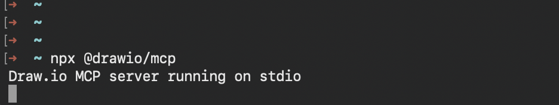
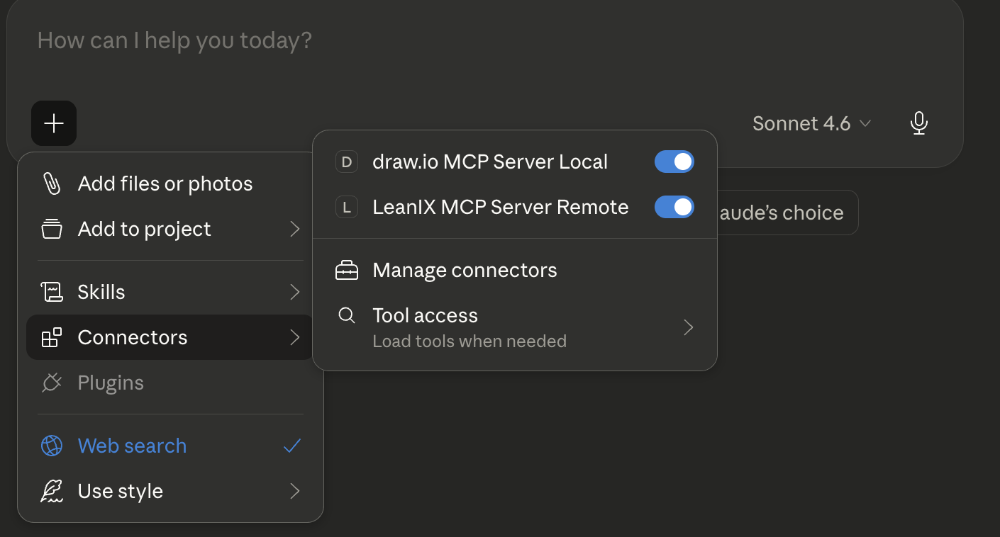

# draw.io-leanix-automation

## 1. Objetivo del flujo

Vamos a utilizar a los MCP de draw.io y Leanix por medio de claude, los pasos que vamos a realizar son los siguientes:

1. Conectar MCP draw.io
2. Conectar al MCP de LeanIX.
3. Leer el diagrama de aplicaciones o el conjunto de factsheets Application relacionados.
4. Recuperar para cada factsheet:
   - nombre
   - tipo
   - descripción
   - tags/labels
   - campos relevantes (obligatorios por ejemplo)
   - relaciones entrantes y salientes
   - Transformar ese inventario a una representación C4.

5. Generar un XML válido de draw.io.
6. Abrirlo en draw.io usando el MCP local de draw.io

### 1. Conectar MCP draw.io

``` bash
npx @drawio/mcp
```

Resultado esperado (ejemplo en Mac):


### 2. Conectar al MCP de LeanIX

Editar el archivo *claude_desktop_config.json* y agregar esta configuracion, reemplazar LXT_MY_LEANIX_TOKEN por un token válido configurado en leanix

``` json
"LeanIX MCP Server Remote": {
      "command": "npx",
      "args": [
        "-y",
        "mcp-remote",
        "https://us.leanix.net/services/mcp-server/v1/mcp",
        "--header",
        "Authorization: Token LXT_MY_LEANIX_TOKEN"
      ]
    }
```

Finalmente agregar la configuracion del MCP de draw.io, el archivo de configuracion debiese ser similar a esto:

``` json
{
  "mcpServers": {
    "LeanIX MCP Server Remote": {
      "command": "npx",
      "args": [
        "-y",
        "mcp-remote",
        "https://us.leanix.net/services/mcp-server/v1/mcp",
        "--header",
        "Authorization: Token LXT_MY_LEANIX_TOKEN"
      ]
    },
    "draw.io MCP Server Local": {
      "command": "npx",
      "args": [
        "-y",
        "@drawio/mcp"
      ]
    }
  },
  "isUsingBuiltInNodeForMcp": true,
  "preferences": {
    "coworkWebSearchEnabled": true,
    "coworkScheduledTasksEnabled": false,
    "ccdScheduledTasksEnabled": false
  }
}
```

Reiniciar Claude, en la configuracion se deberia ver como resultado algo similar a la imagen siguiente:


